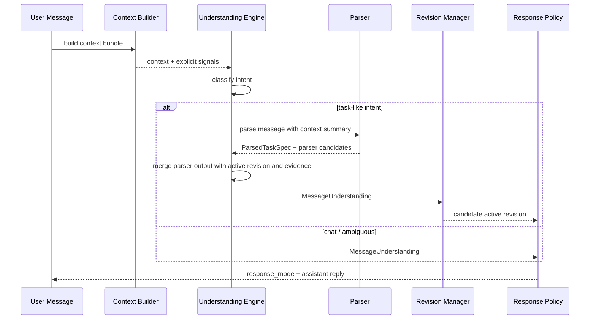
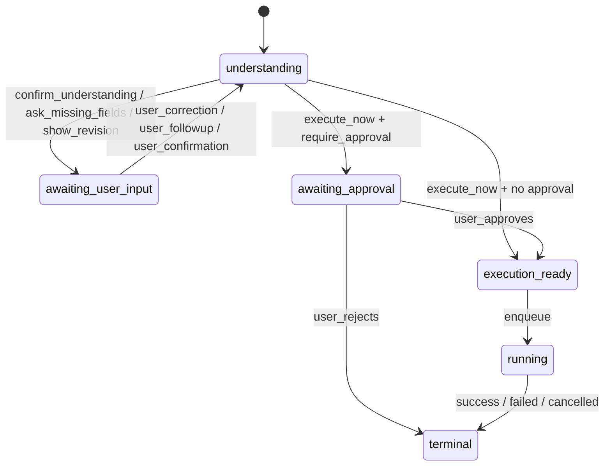

# Conversation Understanding Revisions Design

日期：2026-04-08  
作者：Codex（与项目 owner 共创确认）

## 1. 背景与问题

当前 GIS Agent 已具备以下能力：

- 统一消息入口：`POST /api/v1/messages`
- 基于 LLM 的 `intent` 分类、`parser` 解析、`planner` 规划
- 任务审批、LangGraph 执行、产物输出
- 上传文件、AOI 规范化、任务事件流

但当前系统在多轮理解体验上仍偏“单次判定 + 固定状态机”，主要问题为：

1. 会话上下文使用方式偏硬，主要依赖最近 `N` 条消息，缺少“任务相关上下文包”。
2. 用户纠正上一轮理解时，系统更像处理 follow-up 覆写，而不是显式理解“这是一次任务修正”。
3. AOI 来源判断偏单点规则，难以解释“为什么判成 file_upload / admin_name / bbox”。
4. 系统在“执行 / 澄清”之间缺少中间层，无法自然表达“这是我当前理解，你可以直接改”。
5. 现有 `task_specs` 为单快照结构，不利于保存多轮理解过程、白盒证据和修订历史。

这会带来两个直接结果：

- 用户体验上，系统容易显得“死板”，尤其在上传文件、补充信息、修正 AOI/时间时。
- 工程上，随着更多补丁式 follow-up 逻辑加入，`orchestrator.py` 会持续增长并变得更难维护。

## 2. 目标与非目标

### 2.1 目标

1. 将“纠正 / 补充 / 确认 / 新任务”提升为正式的一等理解意图。
2. 建立 `revision` 机制，使任务理解可以在保留历史的前提下逐步收敛。
3. 将上下文构造从“固定窗口”升级为“显式信号驱动的任务相关上下文包”。
4. 将字段级置信度与证据（evidence）纳入正式数据契约，做到白盒可解释。
5. 用统一的 `response_mode` 替代当前零散的确认/澄清分支。
6. 尽量复用现有 planner / runtime / processing pipeline，不重写 GIS 执行内核。
7. 为前端提供 `understanding_summary`、字段 evidence、内联修正能力的后端基础。

### 2.2 非目标

1. 本期不引入 embedding 检索、长期记忆或隐式语义召回。
2. 本期不尝试“完全自动执行所有高置信任务”，GIS 风险门控仍然保留。
3. 本期不重写 LangGraph runtime、processing pipeline、artifact 存储逻辑。
4. 本期不做用户级长期偏好学习；仅记录结构化 revision / trace 供后续分析。

## 3. 决策（已确认）

1. “纠正”是一等意图，不是 follow-up 特例。
2. “修正”采用 revision，而不是原地覆盖任务快照。
3. `confidence` 驱动 `response_mode`，但不直接等于执行权限。
4. `confidence` 必须白盒化，必须附带 evidence，不接受纯黑盒分数。
5. `Context Builder` 第一版只做显式信号加权，不引入 embedding。
6. `Response Policy` 第一版支持 5 种模式，并通过 extensibility hook 保留扩展空间。
7. 前端支持分两步落地：先展示 understanding，再支持内联修正。
8. 数据迁移采用“新表 + 过渡期镜像现有 `task_specs`”策略，降低执行链重构风险。

## 4. 总体架构

### 4.1 新的理解主链路

```text
用户消息
-> Message Persistence
-> Context Builder
-> Understanding Engine
-> Task Revision Manager
-> Response Policy
-> Planner / Approval / Runtime
-> Assistant Response + Trace Persistence
```

### 4.2 分层职责

1. `Context Builder`
- 组装任务相关上下文，而不是机械截取最近 8 条消息。
- 输出结构化上下文包与显式信号。

2. `Understanding Engine`
- 识别消息意图：`new_task | task_correction | task_confirmation | task_followup | chat | ambiguous`
- 解析候选字段、字段置信度、候选来源与 evidence。

3. `Task Revision Manager`
- 将理解结果映射为 `revision`。
- 负责激活、回滚、计数、版本推进。

4. `Response Policy`
- 根据字段完整性、置信度、任务风险决定系统回应模式。

5. `Planner / Runtime`
- 从当前激活 revision 取“当前任务规格”，继续走既有计划与执行内核。

### 4.3 关键设计原则

1. 理解层与执行层解耦。
2. 所有可影响执行的理解结果必须可追踪、可回滚、可解释。
3. 用户看到的“系统理解”应和系统内部执行输入保持同源。
4. 新增复杂度优先放入新服务，而不是持续堆叠到 `orchestrator.py`。

## 5. 核心概念

### 5.1 ConversationContextBundle

对单条用户消息进行理解时使用的结构化上下文包。

包含：

- `session_id`
- `message_id`
- `latest_active_task`
- `latest_active_revision`
- `recent_uploaded_files`
- `recent_user_messages`
- `recent_assistant_messages`
- `relevant_message_refs`
- `explicit_signals`

第一版 `explicit_signals` 仅来自白盒规则：

- 是否显式提到上传文件 / shp / 边界
- 是否显式提到 bbox
- 是否显式提到行政区名
- 是否命中确认词
- 是否命中纠正式句式
- 是否与最近活跃 revision 存在字段重叠

### 5.2 MessageUnderstanding

针对当前用户消息生成的结构化理解结果。

包含：

- `intent`
- `intent_confidence`
- `understanding_summary`
- `parsed_candidates`
- `field_confidences`
- `field_evidence`
- `ranked_candidates`
- `response_policy_input`

### 5.3 TaskSpecRevision

任务理解的版本化表示，是后续 planner / runtime 的正式上游输入。

revision 的价值：

- 保留历史，不覆盖旧理解
- 支持“用户纠正后继续当前任务”
- 支持分析“系统在哪一层判断出了问题”
- 为前端显示理解变化、差异对比提供基础

### 5.4 Response Mode

统一的交互输出层，第一版支持：

- `execute_now`
- `confirm_understanding`
- `ask_missing_fields`
- `show_revision`
- `chat_reply`

扩展策略：

- 数据契约中保留 `response_payload: dict`，未来如需第 6 种模式，只新增枚举值与 payload 解释，不重写主响应结构。

## 6. 新服务设计

### 6.1 `conversation_context.py`

职责：围绕“当前消息 + 当前会话 + 当前活跃任务”构造理解上下文。

建议接口：

```python
@dataclass
class ConversationContextBundle:
    session_id: str
    message_id: str
    latest_active_task_id: str | None
    latest_active_revision_id: str | None
    latest_active_revision_summary: str | None
    uploaded_files: list[dict[str, object]]
    relevant_messages: list[dict[str, object]]
    explicit_signals: dict[str, object]
    trace: dict[str, object]


def build_conversation_context(
    db: Session,
    *,
    session_id: str,
    message_id: str,
    message_content: str,
    preferred_file_ids: list[str] | None = None,
) -> ConversationContextBundle:
    """Build a task-centric context bundle for the current message."""
```

实现要求：

1. 第一版不做 embedding，只允许白盒规则和显式引用。
2. 上下文选择优先级：
   - 最近活跃 revision
   - 最近上传文件
   - 直接被当前消息引用或实体重叠的消息
   - 最近 clarification / confirmation / correction 消息
   - 少量时间邻近消息
3. `trace` 必须记录“选中了哪些 message/file/task，为什么选中”。

### 6.2 `understanding.py`

职责：整合 intent、parser、AOI 推断、字段级信号，产出统一理解结果。

建议接口：

```python
IntentKind = Literal[
    "new_task",
    "task_correction",
    "task_confirmation",
    "task_followup",
    "chat",
    "ambiguous",
]


@dataclass
class EvidenceItem:
    field: str
    source: str
    weight: float
    detail: str
    message_ref: str | None = None
    upload_file_id: str | None = None


@dataclass
class FieldConfidence:
    score: float
    level: Literal["low", "medium", "high"]
    evidence: list[EvidenceItem]


@dataclass
class MessageUnderstanding:
    intent: IntentKind
    intent_confidence: float
    understanding_summary: str
    parsed_spec: ParsedTaskSpec | None
    parsed_candidates: dict[str, object]
    field_confidences: dict[str, FieldConfidence]
    ranked_candidates: dict[str, list[dict[str, object]]]
    trace: dict[str, object]


def understand_message(
    message: str,
    *,
    context: ConversationContextBundle,
    task_id: str | None = None,
    db_session: Session | None = None,
) -> MessageUnderstanding:
    """Return structured understanding, field confidences, and trace."""
```

设计要求：

1. `intent` 不再局限于 `chat | task | ambiguous`。
2. 输出必须包含字段级置信度与 evidence。
3. `ParsedTaskSpec` 仍复用现有 schema，但不再是唯一上游对象。
4. `trace` 记录每个阶段的白盒输入与中间结果。

#### 6.2.1 Parser Integration Sequence

`Understanding Engine` 与 `parser` 的关系需要明确：

1. `Context Builder` 先完成上下文组装。
2. `Understanding Engine` 先做高层 intent 判断。
3. 若 intent 为 `new_task | task_correction | task_followup | task_confirmation` 之一，则同步调用 parser。
4. parser 输出作为 `parsed_candidates` 和 `parsed_spec` 的组成部分进入理解结果。
5. `Understanding Engine` 再结合 active revision、recent uploads、AOI 候选与 evidence，对 parser 输出进行二次解释。
6. 最终 truth 不是裸 `ParsedTaskSpec`，而是 `MessageUnderstanding + active revision` 共同决定的当前 revision 输入。

结论：

- `ParsedTaskSpec` 仍然是重要中间对象，也是 planner / runtime 过渡期镜像输入。
- `ParsedTaskSpec` 不再单独代表“最终系统理解”。



### 6.3 `task_revisions.py`

职责：管理 revision 生命周期，包括创建、激活、回滚、合并、快照镜像。

建议接口：

```python
@dataclass
class RevisionActivationResult:
    revision_id: str
    revision_number: int
    task_id: str
    is_new_task: bool
    active_task_status: str


def create_initial_revision(
    db: Session,
    *,
    task: TaskRunRecord,
    understanding: MessageUnderstanding,
    source_message_id: str,
) -> TaskSpecRevisionRecord:
    """Create the first revision for a newly created task."""


def create_revision_from_correction(
    db: Session,
    *,
    task: TaskRunRecord,
    base_revision: TaskSpecRevisionRecord,
    understanding: MessageUnderstanding,
    source_message_id: str,
) -> TaskSpecRevisionRecord:
    """Create a new revision derived from the current active revision."""


def activate_revision(
    db: Session,
    *,
    task: TaskRunRecord,
    revision: TaskSpecRevisionRecord,
    mirror_legacy_task_spec: bool = True,
) -> RevisionActivationResult:
    """Mark the supplied revision active and mirror it into legacy task_specs."""


def get_active_revision(db: Session, task_id: str) -> TaskSpecRevisionRecord | None:
    """Return the currently active revision for the task, if any."""
```

设计要求：

1. revision 激活必须在一个事务内完成。
2. 过渡期继续镜像写入 `task_specs.raw_spec_json`，供现有执行链读取。
3. 任何 correction 都创建新 revision，不修改旧 revision。
4. `user_revision_count` 与 `user_last_revision_at` 在 correction 激活时更新。

#### 6.3.1 Correction Activation Sequence

用户纠正不会“就地改当前 revision”，而是走以下时序：

1. 当前消息被识别为 `task_correction`。
2. 基于当前 active revision 创建新 revision 草稿。
3. 新 revision 写入 `task_spec_revisions`，`is_active=false`。
4. 若该 revision 通过基本结构校验，则进入激活事务。
5. 激活事务中：
   - 清除旧 active revision 的 `is_active`
   - 将新 revision 标记为 `is_active=true`
   - 同步更新 `task_runs.last_understanding_message_id`
   - 同步更新 `task_runs.last_response_mode`
   - 过渡期镜像写入 `task_specs`
   - 如为用户纠正，更新 `user_revision_count` 和 `user_last_revision_at`
6. 激活完成后再由 `Response Policy` 选择 `show_revision / confirm_understanding / execute_now`

说明：

- 新 revision 在激活前是短暂中间态，但不对外暴露为 active。
- 第一版不引入额外“draft revision status”字段，是否 active 即可表达中间态。

#### 6.3.2 Revision Activation Reliability

`revision` 激活涉及 `task_spec_revisions`、`task_specs`、`task_runs` 三张表，但它们位于同一数据库内，因此不需要分布式事务。

可靠性要求：

1. 激活必须在同一个数据库事务中完成。
2. 激活前应对所属 task 行做锁定，避免并发 correction 导致双 active。
3. 若事务失败，保持旧 active revision 不变。
4. 激活逻辑必须幂等：重复提交同一 revision 激活请求，不应产生两个 active revision。

### 6.4 `response_policy.py`

职责：根据理解结果与任务风险决定响应模式。

建议接口：

```python
ResponseMode = Literal[
    "execute_now",
    "confirm_understanding",
    "ask_missing_fields",
    "show_revision",
    "chat_reply",
]


@dataclass
class ResponseDecision:
    mode: ResponseMode
    assistant_message: str
    editable_fields: list[str]
    response_payload: dict[str, object]
    requires_task_creation: bool
    requires_revision_creation: bool
    requires_execution: bool


def decide_response_mode(
    understanding: MessageUnderstanding,
    *,
    context: ConversationContextBundle,
    active_revision: TaskSpecRevisionRecord | None,
    require_approval: bool,
) -> ResponseDecision:
    """Select response mode, assistant copy, and follow-up action flags."""
```

决策规则：

1. `chat` -> `chat_reply`
2. 字段缺失严重 -> `ask_missing_fields`
3. correction 且理解可形成新 revision -> `show_revision`
4. 字段完整但存在中风险或中置信度 -> `confirm_understanding`
5. 字段完整 + 低风险 + 高置信度 -> `execute_now`

#### 6.4.1 Bootstrap Thresholds

第一版建议先采用固定阈值，Phase 5 再基于真实数据调参：

| 维度 | low | medium | high |
|------|-----|--------|------|
| `intent_confidence` | `< 0.60` | `0.60 - 0.84` | `>= 0.85` |
| `field_confidence` | `< 0.60` | `0.60 - 0.79` | `>= 0.80` |

初始决策建议：

1. 任一关键字段为 `low` -> `ask_missing_fields`
2. 无 `low`，但存在关键字段为 `medium` -> `confirm_understanding`
3. correction 成功形成可展示 revision -> `show_revision`
4. 所有关键字段为 `high` 且风险为 `low` -> `execute_now`

第一版风险分层建议：

- `low risk`
  - 明确输入文件
  - 明确 AOI 来源
  - 操作为已有白名单且参数完整
- `medium risk`
  - AOI 来源存在候选竞争
  - 用户刚进行了 correction
  - 输出影响已有任务上下文，但可回滚
- `high risk`
  - AOI 规范化失败
  - 关键字段冲突
  - parser 与 prior revision 严重不一致

### 6.5 `parser.py`（增强，不重写）

保留现有 `ParsedTaskSpec` 与 repair loop，但改为理解引擎的子模块。

新增目标：

1. parser repair prompt 注入当前 `ConversationContextBundle` 的摘要。
2. parser 输出进入 `parsed_candidates`，而不是直接作为最终 truth。
3. `_infer_aoi_source_type()` 升级为白盒加权候选生成器。

建议新增接口：

```python
def infer_aoi_source_candidates(
    *,
    message: str,
    aoi_input: str | None,
    context: ConversationContextBundle,
    prior_revision: TaskSpecRevisionRecord | None,
) -> list[dict[str, object]]:
    """Return ranked AOI source candidates with white-box evidence."""
```

#### 6.5.1 Repair Prompt 摘要规则

parser repair prompt 不直接塞入完整上下文，而是使用结构化摘要，避免 prompt 失控。

第一版摘要规则：

1. 当前消息原文
2. active revision 摘要
   - `analysis_type`
   - 当前 AOI 来源
   - 当前 time range
   - 最近一次 response mode
3. 最近上传文件摘要
   - 文件名
   - 文件类型
   - 创建时间
4. 最多 3 条与当前消息强相关的历史消息摘要
   - 仅保留 role + 内容摘要 + message_id
5. 当前显式信号摘要
   - 是否命中上传提示
   - 是否命中 bbox
   - 是否命中纠正句式

禁止直接注入：

- 全量历史消息原文
- 完整 prompt 链
- 大段文件预览内容

## 7. 数据模型设计

### 7.1 新增表：`task_spec_revisions`

建议字段：

- `id: str` 主键
- `task_id: str` 外键 -> `task_runs.id`
- `revision_number: int`
- `base_revision_id: str | None`
- `source_message_id: str` 外键 -> `messages.id`
- `change_type: str`
  - `initial_parse | correction | followup | confirmation | system_repair`
- `is_active: bool`
- `understanding_intent: str`
- `understanding_summary: str | None`
- `raw_spec_json: dict`
- `field_confidences_json: dict`
- `ranked_candidates_json: dict`
- `response_mode: str | None`
- `response_payload_json: dict | None`
- `understanding_trace_json: dict`
- `user_revision_count: int`
- `user_last_revision_at: datetime | None`
- `created_at: datetime`

索引建议：

- `(task_id, is_active)` 复合索引
- `(task_id, revision_number)` 唯一索引
- `(task_id, created_at desc)` 复合索引
- 若数据库支持，增加 `WHERE is_active = true` 的部分唯一索引，保证每个 task 只有一个 active revision

兼容性说明：

1. 若当前数据库支持部分唯一索引，则以数据库约束保证“每 task 仅一个 active revision”。
2. 若不支持部分唯一索引，则采用应用层备选方案：
   - 激活前锁定 `task_runs` 对应行
   - 先清除旧 active，再设置新 active
   - 提交前二次检查同 task 下 active revision 数量
   - 若校验失败则事务回滚

说明：

1. `understanding_trace_json` 必须存摘要，不存整段 prompt / 全量历史原文。
2. `raw_spec_json` 保持可直接恢复为 `ParsedTaskSpec` 所需字段。
3. `field_confidences_json` 与 `ranked_candidates_json` 是前端展示与后续调参的重要依据。

### 7.2 新增表：`message_understandings`

建议字段：

- `id: str` 主键
- `message_id: str` 外键 -> `messages.id`
- `session_id: str` 外键 -> `sessions.id`
- `task_id: str | None`
- `derived_revision_id: str | None`
- `intent: str`
- `intent_confidence: float`
- `understanding_summary: str | None`
- `response_mode: str | None`
- `field_confidences_json: dict`
- `field_evidence_json: dict`
- `context_trace_json: dict`
- `created_at: datetime`

用途：

1. 记录每条用户消息是如何被理解的，即使它没有产生 revision。
2. 支持离线分析：哪些消息被误判为 `chat` / `task_correction`。
3. 支持前端在消息时间线上回放“系统当时是怎么理解的”。

保留与归档建议：

1. `message_understandings` 默认保留完整记录，短期不做强删除。
2. 若增长过快，优先做按月份归档或分区，而不是删除最新数据。
3. 查询默认只按：
   - `message_id`
   - `session_id + created_at`
   - `task_id + created_at`
4. 不为全文搜索设计二级索引；如后续需要，单独建设检索侧表。

### 7.3 保留表：`task_specs`（过渡期镜像）

过渡期策略：

1. 保留 `task_specs`，避免一次性重写 planner / runtime / detail API。
2. active revision 激活时，同步写入 `task_specs`。
3. 执行链优先读取 active revision；若未切换完毕，允许从 `task_specs` 回退。
4. 等所有执行链与详情 API 都切换到 revision 后，再评估是否废弃 `task_specs`。

### 7.4 `task_runs` 的调整

建议新增字段：

- `interaction_state: str | None`
  - `understanding | awaiting_user_input | awaiting_approval | queued | running | terminal`
- `last_understanding_message_id: str | None`
- `last_response_mode: str | None`

说明：

1. 现有 `status` 继续保留，作为执行生命周期字段。
2. 新增 `interaction_state`，避免把“等待用户确认理解”硬塞进 `status` 语义里。

## 8. 状态机设计

### 8.1 双层状态机

采用“双层状态机”而不是把所有交互语义塞进 `task.status`：

1. 执行状态层：`status`
2. 交互状态层：`interaction_state`

### 8.2 执行状态层

保持与现有系统高度兼容：

- `draft`
- `awaiting_approval`
- `approved`
- `queued`
- `running`
- `success`
- `failed`
- `cancelled`
- `waiting_clarification`（过渡期兼容）

### 8.3 交互状态层

新增：

- `understanding`
- `awaiting_user_input`
- `awaiting_approval`
- `execution_ready`
- `running`
- `terminal`

### 8.4 状态转换图



### 8.5 `response_mode` 与状态关系

- `chat_reply`：不创建 task，或附着到现有 task 但不推进 revision
- `ask_missing_fields`：`interaction_state=awaiting_user_input`
- `confirm_understanding`：`interaction_state=awaiting_user_input`
- `show_revision`：`interaction_state=awaiting_user_input`
- `execute_now`：进入 `awaiting_approval` 或 `execution_ready`

#### 8.6 Status × Interaction State 兼容矩阵

第一版兼容矩阵建议如下：

| `task.status` | `interaction_state` | 含义 |
|---------------|---------------------|------|
| `draft` | `understanding` | 正在理解消息，尚未形成稳定 revision |
| `waiting_clarification` | `awaiting_user_input` | 仍需用户补充或确认 |
| `awaiting_approval` | `awaiting_approval` | 任务理解已稳定，等待审批 |
| `queued` | `execution_ready` | 已准备进入执行队列 |
| `running` | `running` | 正在执行 |
| `success/failed/cancelled` | `terminal` | 终态 |

说明：

1. 现有代码中的执行状态名已经是 `awaiting_approval`，本设计不要求重命名。
2. 本次新增的是交互层语义，不是对执行状态枚举的整体替换。

## 9. 白盒 Confidence 设计

### 9.1 设计要求

`confidence` 不是单个数字，而是一组“字段分数 + 证据列表 + 候选排序”。

任何字段置信度都应满足：

- 可解释：为什么是这个分数
- 可展示：前端知道该提示用户改哪里
- 可追踪：离线能分析误判原因

### 9.2 数据结构

建议字段：

```json
{
  "aoi_input": {
    "score": 0.84,
    "level": "high",
    "evidence": [
      {
        "source": "current_message",
        "weight": 0.45,
        "detail": "命中上传文件提示：省.shp"
      },
      {
        "source": "recent_uploads",
        "weight": 0.25,
        "detail": "当前会话存在 shp 上传"
      },
      {
        "source": "prior_revision",
        "weight": 0.14,
        "detail": "用户正在纠正上一轮 AOI 来源"
      }
    ]
  }
}
```

### 9.3 AOI 来源白盒加权（第一版）

候选：

- `file_upload`
- `bbox`
- `admin_name`
- `place_alias`

第一版允许使用的信号：

1. 当前消息显式 bbox
2. 当前消息显式提到上传文件 / shp / 边界
3. AOI 文本是否像行政区
4. 最近上传文件是否存在
5. 当前消息是否是纠正式句式
6. 最近 active revision 的 AOI 来源

输出结构必须包含：

- `best_candidate`
- `confidence`
- `ranked_candidates`
- `evidence`

禁止：

- 只输出一个数字，不给证据
- 用 embedding 黑箱分数替代规则信号

#### 9.3.1 第一版权重示意

第一版只提供启发式初始权重，Phase 5 再做调参：

| 信号 | 建议权重 |
|------|----------|
| 当前消息显式 bbox | `+0.80` 给 `bbox` |
| 当前消息提到上传文件 / shp / 边界 | `+0.70` 给 `file_upload` |
| AOI 文本像行政区 | `+0.50` 给 `admin_name` |
| 最近上传文件存在 | `+0.25` 给 `file_upload` |
| 当前消息是纠正式句式且 prior revision 为某来源 | 对 prior 来源 `-0.20` |
| prior revision 与当前显式信号一致 | 对对应候选 `+0.15` |

说明：

1. 这是 bootstrap 值，不代表最终生产最优值。
2. evidence 必须同时记录“加了多少分”和“为什么加分”。

## 10. API 契约设计

### 10.1 `POST /api/v1/messages` 请求体

请求体第一版保持不变：

```json
{
  "session_id": "sess_xxx",
  "content": "我不是上传了省.shp吗？里面有江西",
  "file_ids": []
}
```

### 10.2 `MessageCreateResponse` 新结构

保留现有字段，并新增正式理解对象。

建议结构：

```json
{
  "message_id": "msg_xxx",
  "mode": "task",
  "task_id": "task_xxx",
  "task_status": "waiting_clarification",
  "assistant_message": "我理解你是想改为使用当前会话里上传的省级 shp，并以其中江西范围作为 AOI。你可以继续修改，或回复继续。",
  "response_mode": "show_revision",
    "understanding": {
      "intent": "task_correction",
      "intent_confidence": 0.91,
      "understanding_summary": "用户正在纠正 AOI 来源，目标应从文本地名切换为上传文件中的江西范围。",
      "revision_id": "rev_xxx",
      "revision_number": 2,
      "editable_fields": ["aoi_input", "aoi_source_type"],
      "field_confidences": {
        "aoi_input": {
          "score": 0.84,
          "level": "high"
        }
      },
      "field_evidence": {
        "aoi_input": [
          "当前消息提到已上传省.shp",
          "会话中存在最近 shp 上传"
        ]
      },
      "ranked_candidates": {
        "aoi_source_type": [
          {"value": "file_upload", "score": 0.9},
          {"value": "admin_name", "score": 0.35}
        ]
      }
    },
  "awaiting_task_confirmation": false,
  "need_clarification": false,
  "missing_fields": [],
  "clarification_message": null
}
```

### 10.3 兼容策略

以下字段保留至少一个迁移周期：

- `awaiting_task_confirmation`
- `need_clarification`
- `missing_fields`
- `clarification_message`

映射关系：

- `confirm_understanding` -> `awaiting_task_confirmation=true`
- `ask_missing_fields` -> `need_clarification=true`
- `show_revision` -> `need_clarification=false`，但 `understanding.editable_fields` 非空

前端兼容约定：

1. Phase 4 默认采用“加字段，不改旧字段语义”的策略，不强制版本化 API。
2. 旧前端若忽略未知字段，仍可只消费旧字段。
3. 新前端可通过 `response_mode` 或 `understanding` 是否存在，判断是否进入新协议能力。
4. 若某一端存在严格 schema 校验，可通过 feature flag 暂不返回新字段，而不是立即升级 API 版本。

### 10.4 任务详情 API 扩展

建议 `TaskDetailResponse` 新增：

- `active_revision`
- `revisions`
- `interaction_state`
- `last_response_mode`

`active_revision` 建议包含：

- `revision_id`
- `revision_number`
- `change_type`
- `understanding_summary`
- `field_confidences`
- `ranked_candidates`
- `created_at`

## 11. 前端集成设计

### 11.1 Phase 4a：只读展示

前端需要支持：

1. 显示 `understanding_summary`
2. 显示字段级置信度与 evidence
3. 显示 `response_mode`
4. 当 `show_revision` 时，展示“本轮理解与上一版差异”

### 11.2 Phase 4b：内联修正

前端需要支持：

1. 基于 `editable_fields` 提供可编辑表单或轻量修改入口
2. 用户提交字段修正后，仍走统一 `POST /messages` 文本入口，或后续新增结构化修正 API
3. 第一期可只支持文本内联修正提示，不强制新增独立 patch 接口

### 11.3 前端展示原则

1. 展示 evidence，而不直接暴露系统内部 prompt。
2. 让用户知道“系统为什么这么理解”。
3. 让用户知道“我改哪个字段最有效”。

## 12. 与现有系统的集成点

### 12.1 `orchestrator.py`

重构方向：

1. 保留消息落库、任务创建、任务返回封装。
2. 将 intent / follow-up / confirmation / upload status 的分支判断逐步下沉到：
   - `conversation_context.py`
   - `understanding.py`
   - `task_revisions.py`
   - `response_policy.py`
3. `orchestrator` 只负责编排，不再承载主要理解策略。

分阶段收缩旧分支：

1. Phase 2 后，现有 intent routing 分支应以 `understanding` 结果为主，旧 `chat | task | ambiguous` 仅保留兼容。
2. Phase 3 后，现有 follow-up override 逻辑应逐步收缩为 revision correction/followup 的兼容 fallback。
3. Phase 4 后，旧的确认提示分支应主要由 `response_mode` 驱动；旧布尔字段仅用于兼容响应。

### 12.2 `parser.py`

保留：

- `ParsedTaskSpec`
- schema repair
- analysis type / time range / operation params 提取能力

增强：

- parser 不再独立决定最终 truth
- parser 输出进入 `MessageUnderstanding.parsed_candidates`
- AOI 推断与 correction 逻辑不再只靠 parser 自身处理

### 12.3 `planner.py` / runtime

短期策略：

1. planner 从 active revision 镜像的 `task_specs` 读入
2. runtime 继续读取当前 `task_runs` + `task_specs` + `aois`
3. 等 Phase 4 稳定后，再考虑 planner 直接读 active revision

### 12.4 `aoi.py`

保留 AOI 规范化逻辑，但触发源改为 active revision。

意味着：

- correction 激活新 revision 后，可重新规范化 AOI
- AOI 规范化失败时，应反馈到 revision trace 与 response policy

#### 12.5 AOI 规范化与 Revision 生命周期

AOI 规范化不应阻止 revision 被创建，但会影响该 revision 是否可直接进入执行。

建议流程：

1. revision 创建时保存原始 AOI 理解结果。
2. 激活后触发 AOI 规范化。
3. 若规范化成功：
   - 更新 `aois`
   - 在 trace 中记录成功摘要
   - `Response Policy` 可继续进入 `confirm_understanding / execute_now`
4. 若规范化失败：
   - 保留该 revision 为 active，但标记其风险为 `high`
   - 追加任务事件，如 `task_aoi_normalization_failed`
   - 在 `understanding_trace_json` 与 `message_understandings` 中记录错误摘要
   - `Response Policy` 强制降级为 `ask_missing_fields`

原因：

- revision 代表“系统此刻的理解”，即便理解无法立即执行，也应保留用于用户继续修正。

## 13. 数据迁移与升级策略

### 13.1 Phase 0

1. 整理 20-30 条 golden conversation fixtures
2. 固化验收指标：
   - correction 识别准确率
   - AOI 来源判定准确率
   - clarification 次数 / 任务
   - correction 收敛成功率
   - 误执行率

### 13.2 Phase 0.5

1. 写正式 System Design Spec
2. 明确新服务接口签名
3. 明确数据库 schema 与索引
4. 编写 Alembic 迁移草案
   - 包括大表回填策略
   - 包括索引创建顺序
   - 包括向后兼容与回滚策略
5. 产出状态机图与测试矩阵

### 13.3 Phase 1：数据层

1. 创建 `task_spec_revisions`
2. 创建 `message_understandings`
3. 为现有 `task_runs` 增加 `interaction_state` 等字段
4. 迁移脚本将现有 `task_specs` 回填为 revision `v1`
5. 激活 revision 时同步镜像更新 `task_specs`

大表迁移策略：

1. Schema migration 与数据 backfill 分离：
   - 先建表、建索引、上代码
   - 再做数据回填
2. 回填采用分批策略：
   - 按主键或创建时间分页
   - 每批固定数量，例如 `500 - 2000` 条
   - 每批单独提交事务
3. 新任务自上线起双写：
   - 写 revision
   - 同步镜像写 `task_specs`
4. 老任务支持 lazy materialization：
   - 若读取任务时发现缺少 revision，可即时生成 `v1`
   - 后台 backfill job 持续补齐

这样即使已有 10 万+ 任务，也无需一次性全量停机迁移。

### 13.4 Phase 2：Context Builder + Understanding Engine

1. 将现有 `intent.py` 扩展为新的 understanding 子能力或逐步下沉
2. 接入 `ConversationContextBundle`
3. 用显式信号版上下文与 evidence 先跑通黄金样例

### 13.5 Phase 3：Correction / AOI / Repair 增强

1. 正式引入 `task_correction`
2. AOI 来源推断升级为加权候选输出
3. parser repair 注入 prior context 与 active revision 摘要

### 13.6 Phase 4：Response Policy + API + Frontend

1. 引入 `response_mode`
2. 扩展 `MessageCreateResponse`
3. 前端 Phase 4a 展示 understanding
4. 前端 Phase 4b 支持内联修正

### 13.7 Phase 5：灰度与调参

1. Shadow mode 并行运行旧链路与新链路
2. 记录差异、误判、用户纠正轨迹
3. 逐步提升新链路权重并保留开关

### 13.8 Feature Flag 策略

建议至少拆成以下独立开关：

1. `conversation_context_enabled`
2. `understanding_engine_enabled`
3. `task_revisions_enabled`
4. `response_mode_enabled`
5. `message_understanding_payload_enabled`
6. `revision_backfill_lazy_enabled`

原则：

1. 能按能力开关，而不是只有一个总开关。
2. 能按环境开关：dev / staging / prod。
3. 能在 Phase 5 灰度时逐项放量。

## 14. 测试策略

### 14.1 单元测试

新增建议：

- `tests/test_conversation_context.py`
- `tests/test_understanding.py`
- `tests/test_task_revisions.py`
- `tests/test_response_policy.py`

增强现有：

- `tests/test_parser.py`
- `tests/test_intent_service.py`
- `tests/test_orchestrator.py`
- `tests/test_message_intent_routing.py`

### 14.2 Golden Conversation Tests

建议新增 fixture 目录：

- `tests/fixtures/conversations/*.json`

每个 fixture 包含：

- 历史消息序列
- 上传文件列表
- 当前输入消息
- 期望 intent
- 期望 response_mode
- 期望 active revision 字段
- 期望 missing fields / editable fields

### 14.3 回归测试重点

1. 现有普通 chat 不能被误升级为 task。
2. 现有高置信 task 仍能进入审批或执行。
3. 现有 AOI 规范化、planner、runtime 不因 revision 引入而回归。
4. upload access 问答仍正常工作。

### 14.4 关键场景样例

必须覆盖：

1. “我不是上传了省.shp吗？里面有江西” -> `task_correction`
2. “时间改成 2023 年 6 月” -> `task_correction`
3. “继续” -> `task_confirmation`
4. “输出改成 geotiff” -> `task_followup` 或 `task_correction`
5. “你能读到我上传的 shp 吗” -> `chat_reply`
6. 新任务字段缺失 -> `ask_missing_fields`
7. 新任务中置信度 -> `confirm_understanding`
8. 新任务高置信低风险 -> `execute_now`

## 15. 可观测性与排障

### 15.1 事件建议

新增任务事件：

- `message_understood`
- `task_revision_created`
- `task_revision_activated`
- `task_revision_superseded`
- `response_mode_selected`
- `understanding_correction_detected`

### 15.2 LLM 调用 phase

建议新增或细分 phase：

- `context`
- `intent`
- `understanding`
- `parse`
- `parse_repair`
- `response_policy`（如需要 LLM 辅助）

### 15.3 排障准则

给定一次错误理解，应能追出：

1. Context Builder 选了哪些消息 / 文件
2. Intent 为什么判成该类型
3. Parser 抽取了什么
4. 每个字段为什么得到当前 confidence
5. Response Policy 为什么选择当前模式

## 16. 风险与缓解

### 16.1 Revision 查询性能

风险：revision 表增长后，读取 active revision 与历史链可能变慢。

缓解：

1. `(task_id, is_active)` 复合索引
2. `(task_id, revision_number)` 唯一索引
3. `(task_id, created_at desc)` 复合索引
4. 任务详情接口只默认返回最近若干 revision，完整历史按需加载

### 16.2 `understanding_trace_json` 过大

风险：若直接存全文上下文与完整 prompt，表会迅速膨胀。

缓解：

1. trace 存 message/file/task 引用与摘要，不存全量原文
2. 对 evidence 与 parser 输出做裁剪
3. 若需要全量 prompt，可继续留在 `llm_call_logs`，不复制到 revision

### 16.3 前端接入节奏过慢

风险：后端已输出新结构，但前端短期无法消化。

缓解：

1. 兼容保留旧字段
2. 先做只读展示，再做内联修正
3. `response_mode` 与 `understanding` 设计成可渐进接入

### 16.4 新旧逻辑并存导致复杂度上升

风险：迁移期同时维护 `task_specs` 与 revisions。

缓解：

1. 明确 `task_spec_revisions` 是 source of truth
2. `task_specs` 仅做过渡镜像
3. 每个 phase 都标明“可删除的旧逻辑”清单

### 16.5 Feature Flag 管理复杂度

风险：功能开关过多后，组合状态可能变复杂。

缓解：

1. 只保留 phase 所需的最小开关集
2. 记录每个环境的开关矩阵
3. 每个 phase 结束后，清理已稳定的临时 flag

## 17. 验收标准

系统应满足：

1. 用户对上一轮任务的纠正可以形成新的 revision，而不是要求重新发起任务。
2. 系统能对白盒展示其理解依据，而不是只给出抽象分数。
3. 中等置信度场景中，系统能表达“这是我当前理解，你可以直接改”。
4. 高置信低风险场景中，系统可按策略直接推进执行链。
5. 引入 revision 后，不破坏现有 planner / runtime / AOI 规范化主链。

## 18. 实施顺序建议

推荐顺序：

1. `Phase 0`：golden fixtures + 指标
2. `Phase 0.5`：正式 spec + migration draft
3. `Phase 1`：revision 数据层 + `task_specs` 镜像
4. `Phase 2`：Context Builder + Understanding Engine
5. `Phase 3`：`task_correction` + AOI 加权推断 + parser repair 增强
6. `Phase 4a`：Response Policy + API + 前端只读展示
7. `Phase 4b`：前端内联修正
8. `Phase 5`：shadow mode + 调参 + 灰度上线

关键路径说明：

1. `Phase 0` 的 golden fixtures 与 `Phase 0.5` 的 schema/interface 设计可以并行推进。
2. 真正的关键路径是：
   - spec 定稿
   - schema migration
   - revision 数据层
   - understanding engine
   - response policy
3. 前端只读展示可在后端 `response_mode + understanding` 契约稳定后并行启动。

## 19. 结论

本设计不重写 GIS 执行内核，而是在其上方增加一层“渐进理解 + revision 驱动 + 白盒置信度”的理解中台。

这使系统从“单次解析后直接进入固定流程”升级为“可持续理解、可纠正、可解释、可审计”的任务代理。

对用户而言，提升点是：

- 更自然地处理“补充 / 纠正 / 确认”
- 能看到系统为什么这么理解
- 能在系统理解基础上直接修正

对工程而言，收益是：

- 将理解复杂度从 `orchestrator.py` 拆分出去
- 通过 revision 与 trace 让排障和调参更可控
- 为后续更复杂的上下文策略与前端交互奠定稳定边界
